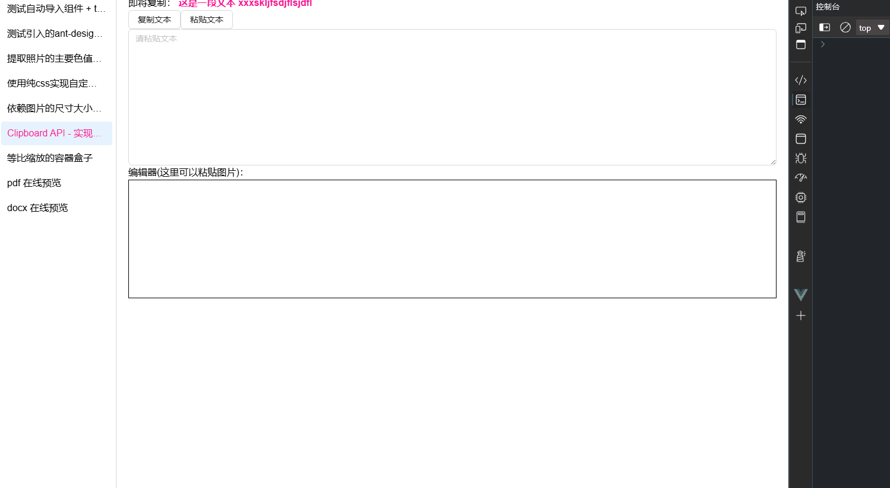
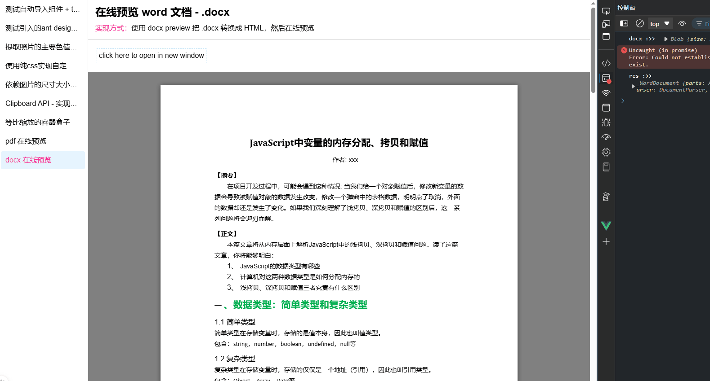
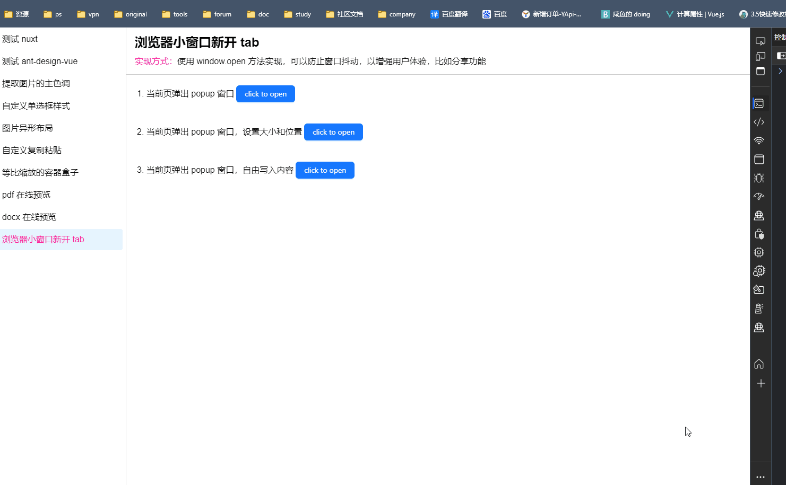
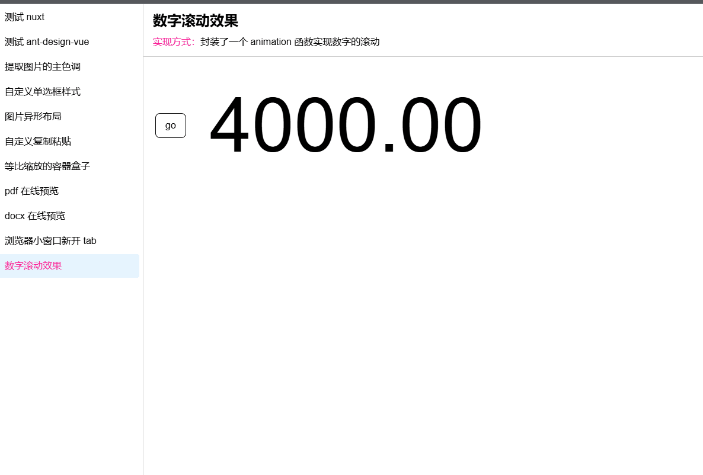
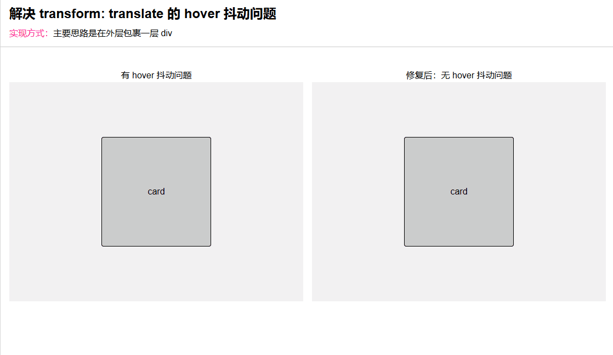

# 安装使用

```bash
pnpm i # 安装依赖
pnpm dev # 运行开发
pnpm build # 打包
pnpm preview # 预览 build 后的文件
```

# 功能日志

1. 初始化 nuxt 项目 (一同维护 nuxt, vue, vue-router 的版本) - 2024.03.10
2. 配置 env 环境变量, 并在 .vue 文件中获得 TS 代码智能提示 - 2024.03.12
3. 添加 https 启动脚本, 并测试 preview 脚本 - 2024.03.13
4. 安装 tailwindcss, (一同维护 tailwindcss, postcss, autoprefixer 的版本) - 2024.03.16
5. 安装 less, 使单文件组件支持 less 语法 - 2024.03.17
6. 安装 ant-design-vue 依赖, (一同维护 @ant-design-vue/nuxt, ant-design-vue 的版本) - 2024.03.17
7. 安装 @ant-design/icons-vue 依赖, (一同维护 @ant-design/icons-vue 的版本) - 2024.03.17
8. 安装 colorthief 依赖，并完成一个 demo, (一同维护 colorthief 的版本) - 2024.03.24
9. 实现 tailwindcss 类名保存时自动排序功能, (一同维护 prettier 和 prettier-plugin-tailwindcss 的版本) - 2024.03.30
10. 实现 git 钩子注册 (一同维护 husky, lint-staged 的版本) - 2024.03.30
11. 添加 @pinia/nuxt 模块，利用 pinia store + 点击事件 实现 layout 动态切换 (一同维护 @pinia/nuxt 的版本) - 2024.04.01
12. 使用纯 css 实现自定义单选框样式 - 2024.04.11
13. 依赖图片的尺寸大小不同，实现 flex 异形布局 - 2024.04.11
14. onErrorCaptured 全局钩子函数捕获错误 + 惰性函数 - 2024.04.12
15. contenteditable(可编辑元素) + Clipboard API 实现自定义复制粘贴文本/图片 - 2024.04.13
16. 解决 tailwindcss 在 css 中的 Unknown at rule 警告问题 - 2024.08.01
17. 实现等比缩放的盒子 + 布局更新 - 2024.08.20
18. 实现 pdf 在线预览功能, (一同维护 pdfjs-dist 的版本) - 2024.08.24
19. 实现 docx 在线预览功能, (一同维护 docx-preview 的版本) - 2024.08.27
20. 添加 浏览器小窗口新开 tab 功能 - 2024.09.02
21. 实现 数字滚动动效 - 2024.09.08
22. 实现 抛物线飞跃动画特效 (TODO)
23. 解决 transform: translate 的 hover 抖动问题 - 2024.11.25
24. 添加 视频播放器 (TODO)
25. 添加 富文本编辑器 (一同维护 @ckeditor/ckeditor5-vue, ckeditor5 的版本) - 2025.02.18
26. 添加 邮件发送功能 (一同维护 nodemailer, @types/nodemailer 的版本) - 2025.02.18
27. 解决 iconfont 图标在刷新页面后的闪烁问题, (一同维护 @nuxt/icon 的版本) - 2025.02.18

# demo 索引

## 1. demo1 —— 使用 colorthief 提取图片色彩，并设置成渐变背景到任意元素


## 2. demo2 —— 使用 :checked 伪类 + label + 相邻兄弟选择器(~) 实现自定义单选框样式


## 3. demo3 —— 简单的 flex 异形布局，需要图片尺寸大小不同


## 4. demo4 —— contenteditable(可编辑元素) + Clipboard API - 实现自定义复制粘贴文本/图片


## 5. demo5 —— 等比缩放的盒子


## 6. demo6 —— pdf 在线预览



## 7. demo7 —— docx 在线预览



## 8. demo8 —— 浏览器小窗口新开 tab 功能



## 9. demo9 —— 数字滚动动效



## 10. demo10 —— 抛物线飞跃动画特效（TODO...）

## 11. demo11 —— 解决 transform: translate 的 hover 抖动问题


