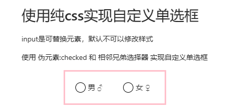
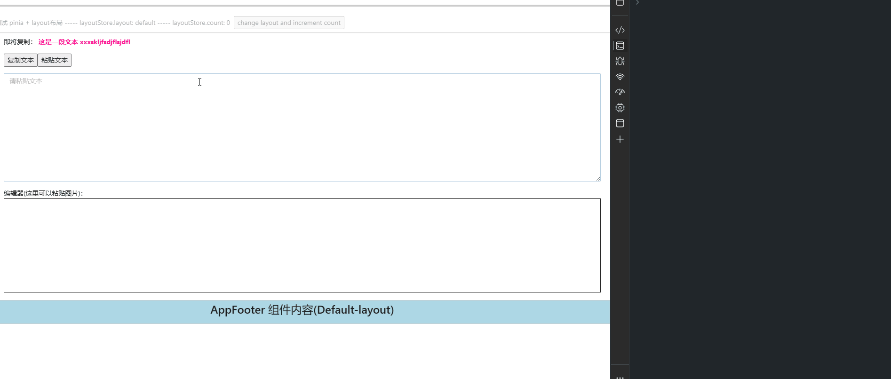

# 安装使用

```bash
pnpm i # 安装依赖
pnpm dev # 运行开发
pnpm build # 打包
pnpm preview # 预览 build 后的文件
```

# 功能日志

1. 初始化项目 - 2024.03.10
2. 配置 env 环境变量, 并在 .vue 文件中获得 TS 代码智能提示 - 2024.03.12
3. 添加 https 启动脚本, 并测试 preview 脚本 - 2024.03.13
4. 添加 tailwindcss 并测试 - 2024.03.16
5. 添加 less 和 ant-design-vue@3.2.20 并测试 - 2024.03.17
6. 添加 colorthief 依赖，并完成一个 demo - 2024.03.24 (TODO: 怎么在设置渐变背景的时候给个过渡？)
7. 添加 prettier + prettier-plugin-tailwindcss 依赖，实现 tailwindcss 类名自动排序 - 2024.03.30
8. 添加 husky + lint-staged 依赖，实现 git 钩子注册 - 2024.03.30
9. 添加 @pinia/nuxt 模块，利用 pinia store + 点击事件 实现 layout 动态切换 - 2024.04.01
10. 使用纯 css 实现自定义单选框样式 - 2024.04.11
11. 依赖图片的尺寸大小不同，实现 flex 异形布局 - 2024.04.11
12. onErrorCaptured 全局钩子函数捕获错误 + 惰性函数 - 2024.04.12
13. contenteditable(可编辑元素) + Clipboard API 实现自定义复制粘贴文本/图片 - 2024.04.13
14. 升级 nuxt 版本，解决 tailwindcss 在 css 中的 Unknown at rule 警告问题 - 2024.08.01

# demo 索引

## 1. demo1 —— 使用 colorthief 提取图片色彩，并设置成渐变背景到任意元素


## 2. demo2 —— 使用 :checked 伪类 + label + 相邻兄弟选择器(~) 实现自定义单选框样式



## 3. demo3 —— 简单的 flex 异形布局，需要图片尺寸大小不同


## 4. demo4 —— contenteditable(可编辑元素) + Clipboard API - 实现自定义复制粘贴文本/图片


